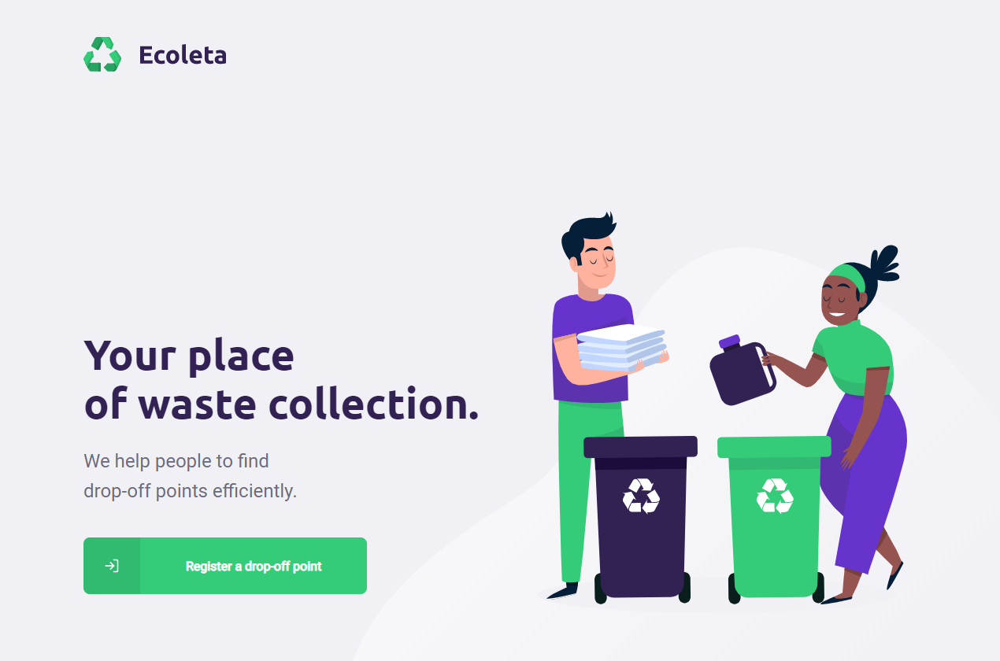
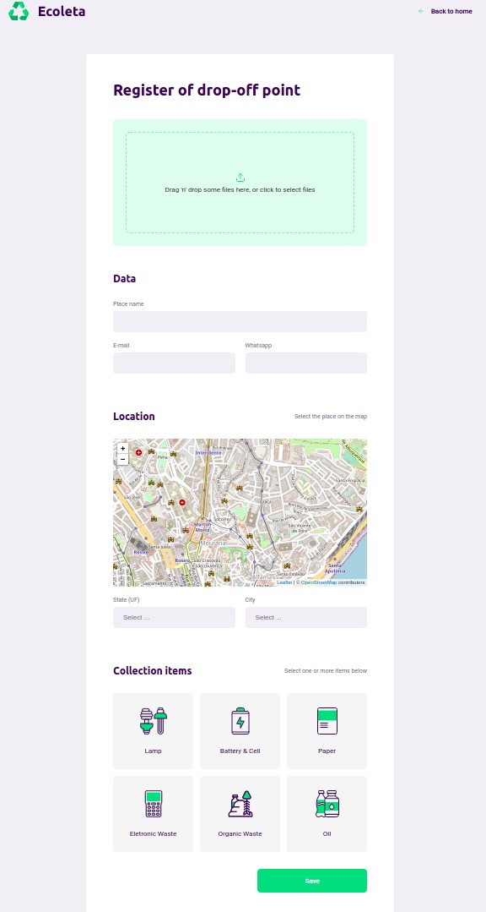
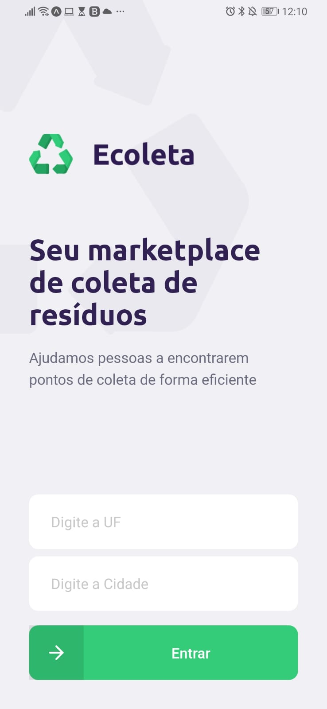
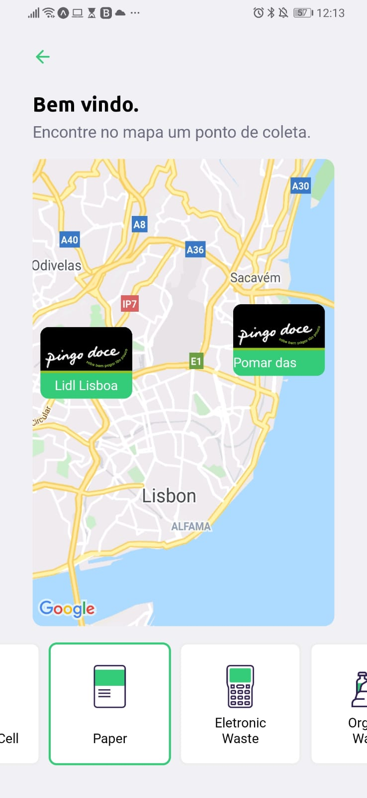
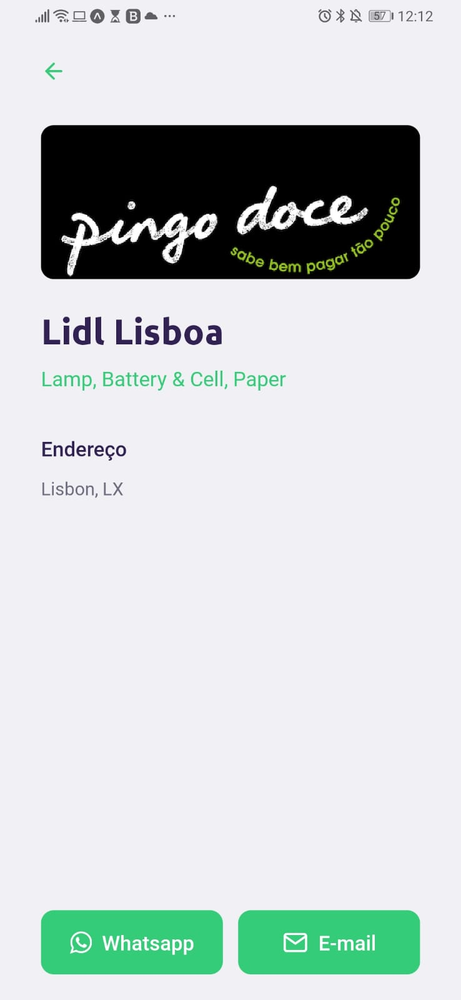

# Product

**e-Recycling** is an application that aims to help people find places that collect specific types of waste, encouraging people to recycle more.

This product has been created during Rocketseat's **Next Level Week 1** that is a working week with lots of code, challenges, networking and a single objective: to take you to the next level. Through our method, you will learn new tools, learn about new technologies and discover hacks that will boost your career. An online and completely free event that will help you take the next step in your evolution as a dev.

## Getting Started

These instructions will get you a copy of the project up and running on your local machine for development and testing purposes.

### Prerequisites

What things you need to install the software and how to install them?

To run the application you will need:

- [Git](https://git-scm.com/)
- [Node](https://nodejs.org/)
- [Yarn](https://yarnpkg.com/)
- [Expo](https://play.google.com/store/apps/details?id=host.exp.exponent&hl=en)

## Installing

### Install API

```bash
# Clone this repository
$ git clone https://github.com/joaozarate/e-Recycling.git

# Go into the repository
$ cd e-Recycling/backend

# Install dependencies
$ yarn install

# Run Migrates
$ yarn knex:migrate

# Run Seeds
$ yarn knex:seed

# Start server
$ yarn dev

# running on port 3333
```

### Install Front-end

```bash
# Clone this repository
$ git clone https://github.com/joaozarate/e-Recycling.git

# Go into the repository
$ cd e-Recycling/frontent

# Install dependencies
$ yarn install

# Run
$ yarn start

# running on port 3000
```

### Install Mobile

The Application was developed using Expo. It is a free and open source toolchain built around React Native to facilitate the process of running and testing applications. [Click here](https://expo.io/learn) to get start with Expo.

```bash
# Clone this repository
$ git clone https://github.com/joaozarate/e-Recycling.git

# Go into the repository
$ cd e-Recycling/mobile

# Install dependencies
$ yarn install

# Run
$ yarn start

# Expo will open, just scan the qrcode on terminal or expo page

# If some problem with fonts, follow the link:
https://forums.expo.io/t/sdk-37-unrecognized-font-family/35201/11
```

## How it looks like

### Web

Home



Create



### Mobile

Home



Map



Detail



## Built With

This project was developed with the following technologies:

- [TypeScript](https://github.com/Microsoft/TypeScript)
- [Express](https://github.com/expressjs/express)
- [React](https://github.com/facebook/react)
- [React Native](https://github.com/facebook/react-native)
- [Expo](https://github.com/expo/expo)
- [Knex](http://knexjs.org/)
- [Multer](https://www.npmjs.com/package/multer)
- [SQLite3](https://www.sqlite.org/index.html)

## Contributing

1. Fork it!
2. Create your feature branch: `git checkout -b my-new-feature`
3. Commit your changes: `git commit -am 'Add some feature`
4. Push to the branch: `git push origin my-new-feature`
5. Submit a pull request :D

## Versioning

v1.0.0-alpha

## Authors

- **João Zarate** - *Initial work* - [João Zarate](https://github.com/joaozarate)

## License

This project is licensed under the MIT License - see the [LICENSE.md](https://gist.github.com/PurpleBooth/LICENSE.md) file for details

## Acknowledgments

I would like to thank [Rocketseat](https://github.com/Rocketseat) for creating and providing the teaching and methodology that created this product.
